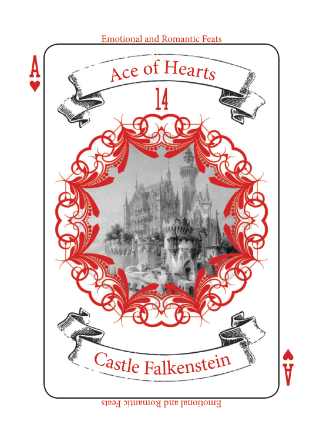
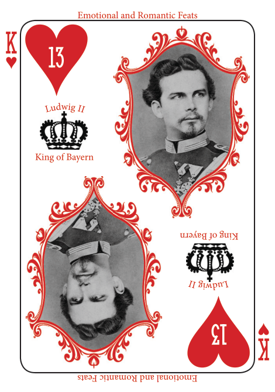
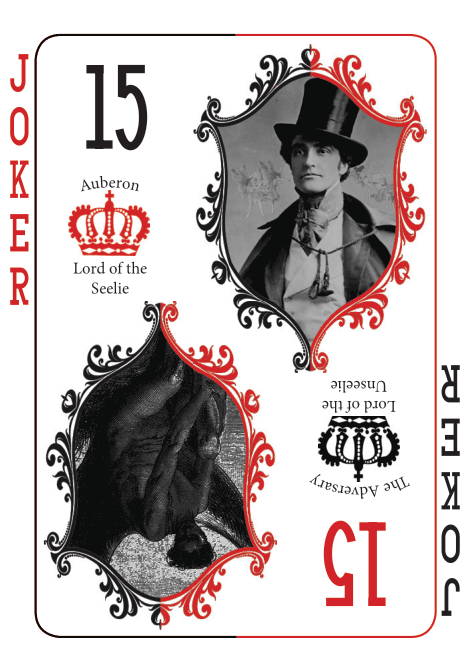
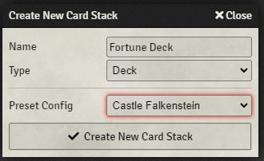

# Castle Falkenstein FoundryVTT system - User Guide

# Setup required from the Host
> N.B. this manual setup is very likely going to be automated in a future version

The first step to using this system is for the GM to create Fortune and Sorcery decks and discard piles within Foundry VTT.

This system natively supports the creation of decks based on [RTG's official Fortune Deck visuals](https://rtalsoriangames.com/2020/07/24/falkenstein-friday-the-fortune-deck/).

|  |  |  |

To use these visuals, make sure to select the dedicated preset within FoundryVTT:

|GM must create a      |of type | which has player permissions                         |
| :------------------- | :----- | :--------------------------------------------------- |
| Fortune Deck         |Deck    | Limited                                              |
| Fortune discard pile |Pile    | Observer                                             |
| Fortune Deck         |Deck    | Limited (relevant for Sorcerer/Dragon players only)  |
| Sorcery discard pile |Pile    | Observer (relevant for Sorcerer/Dragon players only) |

Once done, go to `Configure Settings > System Settings > Castle Falkenstein` to register these 4 deck/piles into the Castle Falkenstein system.

Make sure you shuffle the decks before your players get a chance to draw cards from them also.

# Character Sheet
The same character sheet is used for PCs and NPCs.

As per FoundryVTT default behaviour, if the permission level granted to a non-GM player on a character is 'None' (default), then the character does not appear to the player in the Actors tab.

And here is what happens with higher permission levels:

| Character sheet part | Limited | Observer | Owner  | Host (GM) |
|----------------------|:-------:|:--------:|:------:|:---------:|
| Avatar               | View    | View     | Update | Update    |
| Name                 | View    | View     | Update | Update    |
| Health & Wounds      | -       | View     | Update | Update    |
| Description          | View    | View     | Update | Update    |
| Diary                | -       | View     | Update | Update    |
| Abilities            | -       | View     | Update | Update    |
| Possessions          | -       | View     | Update | Update    |
| Spells               | -       | View     | Update | Update    |
| Host Notes           | -       | -        | -      | Update    |

General recommendation for the Host:
- give each player an 'Owner' permission on their PC
- give all players a 'Limited' permission on PCs which are not their own
- during sessions, give players a 'Limited' permission on NPCs they meet, and do not put secret information in the 'Description' tab of these NPC sheets (unless you explicitly use the 'Secret' formatting option for it)

## Alternative: Diaries as 📖 Journal Entries
To reinforce the notion of character diaries being a part of the world, the Host may elect to use dedicated 📖 Journal Entries for each Player Character's (or NPC's) Diary.
In this case, the 📖 Journal Entry should probably be drag-and-dropped into the Journal tab of the Character Sheet afterwards, for easier access by the player and Host.
